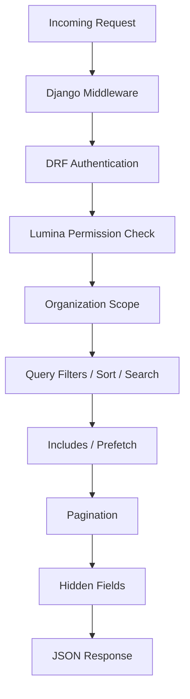

# Request Lifecycle

Every API request processed by Lumina follows a structured pipeline through multiple layers.

## 1. Django Middleware Layer

Lumina provides middleware for multi-tenancy:

- **`AuditMiddleware`** — stores the current request for audit trail logging
- **`ResolveOrganizationFromRouteMiddleware`** — resolves org from URL parameter
- **`ResolveOrganizationFromSubdomainMiddleware`** — resolves org from subdomain

## 2. DRF Authentication

Token-based authentication via Django REST Framework's `TokenAuthentication`. Models in the `PUBLIC` list skip authentication.

## 3. Permission Check

Lumina uses a policy-based permission system. Each action maps to a policy method:

| Action       | Policy Method      | Permission Format       |
|-------------|--------------------|-------------------------|
| `list`      | `view_any()`       | `{slug}.index`          |
| `retrieve`  | `view()`           | `{slug}.show`           |
| `create`    | `create()`         | `{slug}.store`          |
| `update`    | `update()`         | `{slug}.update`         |
| `destroy`   | `delete()`         | `{slug}.destroy`        |
| `trashed`   | `view_trashed()`   | `{slug}.trashed`        |
| `restore`   | `restore()`        | `{slug}.restore`        |
| `force_delete` | `force_delete()` | `{slug}.force_delete`  |

## 4. Organization Scope

If multi-tenancy is enabled, queries are automatically scoped to the current organization using the `organization_id` field.

## 5. Query Builder

Lumina applies query parameters in this order:

1. **Filters** — `?filter[status]=published`
2. **Sorting** — `?sort=-created_at`
3. **Search** — `?search=django`
4. **Includes** — `?include=comments` (with authorization check)

## 6. Pagination

When `?per_page=N` is provided, Lumina returns paginated results with metadata in response headers.

## 7. Hidden Fields

Fields defined in `lumina_hidden_fields` or by the policy's `hidden_fields()` method are stripped from the response.

## 8. JSON Response

The final JSON response is returned with appropriate HTTP status codes and headers.
