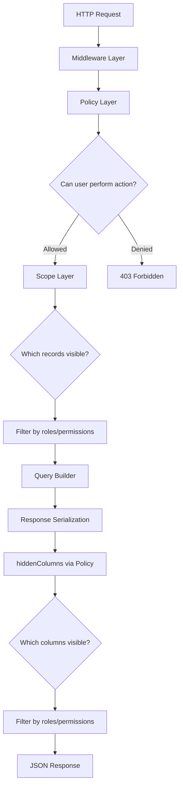

# Request Lifecycle

Every API request flows through Lumina's pipeline — a series of layers that handle authentication, authorization, scoping, querying, and response formatting. Understanding this flow helps you debug issues and know exactly where to customize behavior.



## 1. Middleware Layer

The first layer your request hits. Middleware runs **before** any controller logic and can reject requests early.

Lumina applies middleware in this order:

1. **Global middleware** — Laravel's default stack (CORS, authentication, etc.)
2. **Model middleware** — Defined via `$middleware` on your model (applies to all actions)
3. **Action middleware** — Defined via `$middlewareActions` (applies to specific actions only)

```php
class Post extends Model
{
    // Applied to ALL routes for this model
    public static array $middleware = ['auth:sanctum'];

    // Applied only to specific actions
    public static array $middlewareActions = [
        'store'   => ['verified'],
        'destroy' => ['can:admin'],
    ];
}
```

If middleware rejects the request, the pipeline stops here and returns the appropriate error (401, 403, 429, etc.).

## 2. Policy Layer

After middleware passes, Lumina checks the **ResourcePolicy** to determine if the authenticated user can perform the requested action.

Each CRUD action maps to a policy method:

| HTTP Method | Action | Policy Method |
|-------------|--------|---------------|
| `GET /posts` | index | `viewAny($user)` |
| `GET /posts/{id}` | show | `view($user, $post)` |
| `POST /posts` | store | `create($user)` |
| `PUT /posts/{id}` | update | `update($user, $post)` |
| `DELETE /posts/{id}` | destroy | `delete($user, $post)` |

The policy checks the user's **roles and permissions** for the current organization. If the user lacks the required permission, a `403 Forbidden` response is returned immediately.

```php
class PostPolicy extends ResourcePolicy
{
    // Permission format: posts.viewAny, posts.create, etc.
    // Wildcards supported: posts.* or just *
}
```

See [Policies](./policies) for full details on permission configuration.

## 3. Scope Layer

Once authorized, Lumina determines **which records** the user can see. This is the multi-tenancy boundary.

Scoping ensures users only access data belonging to their current organization:

- Models with `organization_id` are filtered directly
- Nested models use the `$owner` path to traverse relationships back to the organization
- Custom scopes (via `HasAutoScope`) can add additional filtering

```php
// Direct: WHERE organization_id = ?
class Blog extends Model
{
    use BelongsToOrganization;
}

// Nested: WHERE EXISTS (post.blog.organization_id = ?)
class Comment extends Model
{
    use BelongsToOrganization;
    public static string $owner = 'post.blog';
}
```

See [Multi-Tenancy](./multi-tenancy) for full details.

## 4. Query Builder

With the scope applied, Lumina builds the database query using parameters from the request URL:

| Feature | Query Parameter | Example |
|---------|----------------|---------|
| **Filtering** | `?filter[field]=value` | `?filter[status]=published` |
| **Sorting** | `?sort=field` | `?sort=-created_at` |
| **Searching** | `?search=term` | `?search=laravel` |
| **Pagination** | `?page=N&per_page=N` | `?page=2&per_page=25` |
| **Includes** | `?include=relation` | `?include=user,tags` |
| **Fields** | `?fields[model]=f1,f2` | `?fields[posts]=id,title` |

Only fields declared in `$allowedFilters`, `$allowedSorts`, `$allowedSearch`, `$allowedIncludes`, and `$allowedFields` on your model are accepted. Anything else is silently ignored.

See [Querying](./querying) for full details.

## 5. Response Serialization

The query results are serialized into JSON. For `index` endpoints, Lumina adds pagination headers:

| Header | Description |
|--------|-------------|
| `X-Current-Page` | Current page number |
| `X-Last-Page` | Total number of pages |
| `X-Per-Page` | Items per page |
| `X-Total` | Total number of records |

## 6. Hidden Columns via Policy

Before sending the response, Lumina checks the policy's `hiddenColumns()` method to determine if any columns should be stripped based on the user's role:

```php
class PostPolicy extends ResourcePolicy
{
    public function hiddenColumns($user): array
    {
        if ($user->hasPermission('posts.viewSensitive')) {
            return []; // Admin sees everything
        }

        return ['internal_notes', 'cost_price']; // Regular users can't see these
    }
}
```

This provides **column-level security** — different users see different fields in the same response, all controlled by permissions.

## 7. JSON Response

The final JSON response is returned to the client. For a single resource:

```json
{
  "id": 1,
  "title": "My Post",
  "status": "published",
  "created_at": "2025-01-15T10:30:00Z"
}
```

For a collection (index), the response includes the data array with pagination headers in the HTTP response.

## Summary

```
Request → Middleware → Policy → Scope → Query → Serialize → Hide Columns → Response
```

Each layer is independently configurable through your model properties and policy methods. If something isn't working as expected, trace the request through these layers to identify where the issue occurs.
